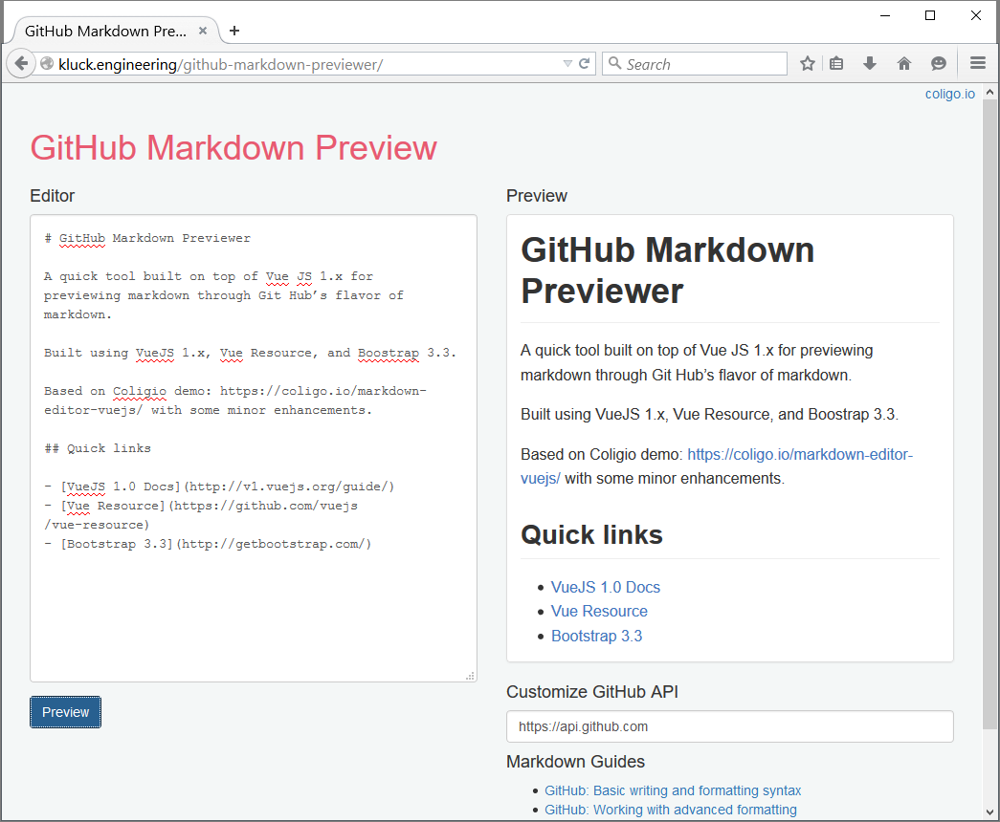

# GitHub Markdown Previewer

A quick tool built on top of Vue JS 1.x for previewing markdown through Git Hub’s flavor of markdown.

Built using VueJS 1.x, Vue Resource, and Boostrap 3.3.

Based on Coligio demo: https://coligo.io/markdown-editor-vuejs/ with some minor enhancements.

## Quick links

- [VueJS 1.0 Docs](http://v1.vuejs.org/guide/)
- [Vue Resource](https://github.com/vuejs/vue-resource)
- [Bootstrap 3.3](http://getbootstrap.com/)

### Example

